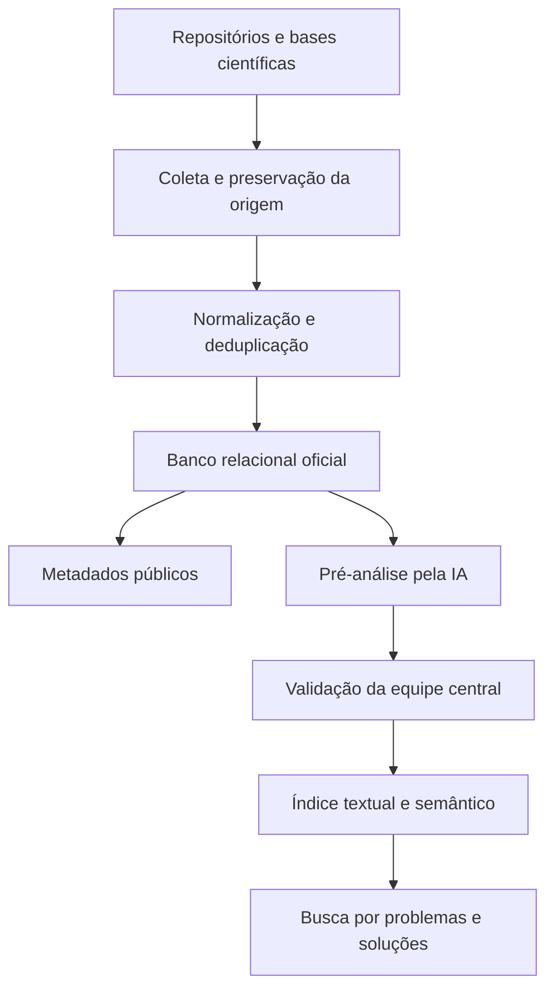
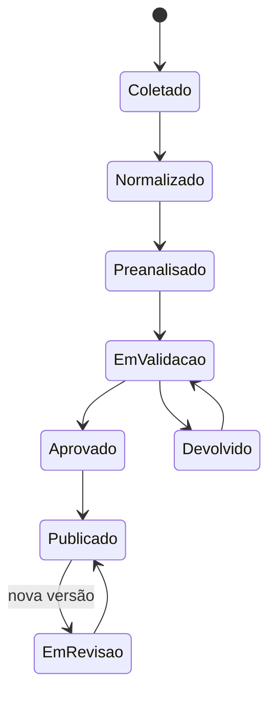

# Pernambuco Ciência para Inovação

## Documento de requisitos científicos e tecnológicos

**Versão:** 1.0  
**Data:** 8 de setembro de 2026  
**Status:** desenho aprovado para revisão formal  
**Natureza:** artefato de tese e especificação conceitual do MVP

## 1. Síntese executiva

O Pernambuco Ciência para Inovação será uma plataforma pública de inteligência científica e tecnológica territorial. Seu propósito é reunir a produção científica e tecnológica relacionada ao estado de Pernambuco e reorganizá-la a partir de problemas, soluções, evidências, barreiras, competências, territórios e possibilidades de aplicação.

A plataforma não será apenas um agregador de repositórios. Seu diferencial será permitir que uma pessoa descreva um problema em linguagem comum e encontre conhecimento validado que possa contribuir para sua compreensão ou resolução.

O banco relacional será a fonte oficial, versionada e auditável. Uma camada textual e semântica apoiará a recuperação por significado. Metadados provenientes das fontes poderão ser publicados após controles de qualidade; interpretações produzidas pela inteligência artificial somente serão disponibilizadas ao público após validação humana integral pela equipe central.

## 2. Problema de informação

A produção científica e tecnológica relevante para Pernambuco encontra-se distribuída em repositórios, bases, portais e sistemas com diferentes estruturas, padrões e níveis de qualidade. A recuperação costuma depender de autoria, título, instituição, área ou palavras-chave e raramente explicita:

- o problema investigado;
- a solução proposta;
- as evidências que a sustentam;
- as barreiras identificadas;
- as condições necessárias para aplicação;
- o nível de maturidade da solução;
- as competências científicas e tecnológicas relacionadas;
- a relação entre a produção e o território pernambucano.

O problema central não é apenas a dispersão documental, mas a dificuldade de transformar informação científica disponível em conhecimento encontrável, compreensível, confiável e potencialmente utilizável na solução de problemas públicos, sociais, econômicos, ambientais e tecnológicos.

## 3. Questão orientadora

Como organizar, representar, recuperar e validar a produção científica e tecnológica produzida em Pernambuco e sobre Pernambuco para apoiar a descoberta de soluções aplicáveis a problemas do território e do ecossistema de inovação?

## 4. Objetivo do artefato

Desenvolver e avaliar uma plataforma de inteligência científica e tecnológica territorial que reúna metadados de diferentes fontes, relacione produções a problemas e soluções e ofereça recuperação semântica com proveniência, evidências e validação humana.

## 5. Decisões de escopo aprovadas

| Dimensão | Decisão |
|---|---|
| Áreas do conhecimento | Todas as áreas desde o início |
| Período | Todo o acervo disponível, sem corte temporal |
| Tipos de produção | Produção científica e tecnológica completa |
| Critério territorial | Dois universos separados e relacionáveis |
| Público | Ecossistema amplo de inovação |
| Jornada principal | Buscar soluções para um problema |
| Extração semântica | Pré-análise por IA |
| Validação | Validação humana de todos os registros enriquecidos |
| Autoridade de validação | Equipe central da plataforma |
| Publicação pendente | Metadados públicos; inteligência após validação |
| Priorização inicial | Amostra estratificada e representativa |
| Arquitetura | Banco relacional com camada semântica |

### 5.1 Produção científica e tecnológica completa

O universo documental poderá incluir, conforme disponibilidade e aderência às fontes:

- artigos científicos;
- teses e dissertações;
- trabalhos de conclusão de curso;
- livros e capítulos;
- trabalhos publicados em eventos;
- relatórios técnicos e científicos;
- projetos de pesquisa, desenvolvimento e inovação;
- patentes e outros ativos de propriedade intelectual;
- softwares, algoritmos e sistemas;
- conjuntos de dados de pesquisa;
- protocolos, métodos, processos e tecnologias sociais;
- produtos educacionais, técnicos ou tecnológicos;
- outros resultados reconhecidos pelas instituições participantes.

Cada tipo será identificado por vocabulário controlado e não será artificialmente convertido em artigo ou documento bibliográfico.

### 5.2 Dois universos territoriais

1. **Ciência produzida em Pernambuco:** produção vinculada a instituição pública de ensino ou pesquisa com sede, campus ou unidade no estado, independentemente do território estudado.
2. **Ciência sobre Pernambuco:** produção cujo objeto, população, aplicação ou território estudado esteja em Pernambuco, independentemente da localização da instituição produtora.

Um registro poderá pertencer aos dois universos. Os critérios serão armazenados separadamente para evitar confusão entre capacidade instalada e território investigado.

### 5.3 Limite operacional do MVP

O escopo de cobertura é amplo, mas sua execução ocorrerá em duas camadas:

- **camada de acervo:** ingestão progressiva de todos os metadados acessíveis nas fontes elegíveis;
- **camada de inteligência:** enriquecimento por IA e validação humana progressiva, começando por amostra estratificada e representativa.

Essa separação permite crescimento do catálogo sem apresentar interpretações automáticas como conhecimento validado.

## 6. Usuários e necessidades

O público compreende:

- gestores e formuladores de políticas públicas;
- pesquisadores, estudantes e grupos de pesquisa;
- profissionais da informação;
- núcleos de inovação tecnológica;
- parques tecnológicos, incubadoras e ambientes de inovação;
- empresas e empreendedores;
- organizações sociais e organizações da sociedade civil;
- profissionais de diferentes setores;
- cidadãos interessados.

Necessidades centrais:

- localizar conhecimento a partir de um problema concreto;
- descobrir soluções propostas, testadas ou implementadas;
- comparar evidências, barreiras e maturidade;
- identificar pesquisadores, grupos, laboratórios e instituições competentes;
- compreender a distribuição territorial da ciência;
- acessar a produção original e verificar sua proveniência;
- distinguir metadados coletados de inteligência validada.

## 7. Princípios do sistema

1. **Orientação por problemas:** a principal porta de entrada será a necessidade do usuário.
2. **Proveniência:** todo dado deverá indicar sua fonte e histórico.
3. **Validação humana:** nenhuma interpretação da IA poderá ser publicada automaticamente.
4. **Transparência:** respostas deverão citar produções e trechos que as sustentam.
5. **Separação territorial:** produção em Pernambuco e produção sobre Pernambuco serão dimensões distintas.
6. **Interoperabilidade:** cada fonte será integrada sem eliminar sua identidade.
7. **Versionamento:** correções e atualizações não apagarão estados anteriores.
8. **Responsabilidade:** ausência de dados ou evidências será comunicada, nunca preenchida por suposição.
9. **Acesso público:** a consulta pública não exigirá autenticação.
10. **Evolução controlada:** taxonomias, modelos e critérios serão versionados.

## 8. Arquitetura aprovada

### 8.1 Componentes

| Componente | Responsabilidade |
|---|---|
| Conectores de fontes | Coletar registros por OAI-PMH, API, XML, CSV ou mecanismo institucional disponível |
| Área de preservação | Manter o registro original, a fonte, o momento da coleta e a resposta recebida |
| Normalização | Padronizar pessoas, instituições, áreas, tipos, datas, identificadores e territórios |
| Deduplicação | Identificar manifestações do mesmo produto sem eliminar evidências ambíguas |
| Banco relacional | Armazenar entidades oficiais, relações, versões, validações e auditoria |
| Repositório de arquivos | Guardar conteúdo permitido e artefatos técnicos; direcionar à origem quando não houver direito de cópia |
| Serviço de IA | Produzir rascunhos de classificação e extração semântica |
| Console de validação | Permitir revisão humana campo a campo, com trechos de fundamento |
| Índice textual | Recuperar termos, títulos, autores, resumos e metadados |
| Índice vetorial | Recuperar proximidade de significado entre problemas, soluções e documentos |
| Aplicação pública | Oferecer busca, filtros, comparação, perfis e panorama territorial |
| Observabilidade | Registrar falhas, atrasos, qualidade, cobertura e desempenho |

### 8.2 Fonte oficial

O banco relacional será a fonte oficial. Índices textuais, vetoriais e futuras projeções em grafo serão derivados reconstruíveis, nunca a única cópia dos dados validados.

## 9. Fluxo dos dados

1. A fonte é cadastrada com instituição, forma de acesso, direitos e periodicidade.
2. O conector coleta registros e preserva os dados originais.
3. O sistema valida estrutura, identifica falhas e normaliza campos.
4. Registros potencialmente duplicados são relacionados e, quando seguro, consolidados.
5. O registro canônico é gravado no banco relacional.
6. Os metadados aptos são indexados e publicados.
7. O serviço de IA produz rascunhos semânticos e associa trechos de fundamento.
8. A equipe central revisa cada dimensão.
9. Somente dimensões aprovadas são incorporadas ao índice semântico público.
10. Atualizações de fonte criam versões e podem reabrir a validação.

## 10. Modelo conceitual

### 10.1 Entidades principais

| Entidade | Representação |
|---|---|
| Produção | Resultado científico ou tecnológico central |
| Fonte | Sistema, repositório, base ou portal de origem |
| Versão | Estado temporal de um registro ou análise |
| Pessoa | Autor, orientador, pesquisador, curador ou validador |
| Organização | Instituição, programa, grupo, laboratório ou empresa |
| Vínculo | Relação temporal entre pessoa, organização e produção |
| Classificação científica | Grande área, área, subárea e especialidade |
| Território institucional | Localização da unidade produtora |
| Território estudado | Local, população ou contexto investigado |
| Problema | Situação, necessidade, insuficiência ou obstáculo investigado |
| Solução | Produto, método, processo, tecnologia, intervenção ou recomendação |
| Evidência | Resultado que sustenta uma solução ou conclusão |
| Barreira | Condição que restringe desenvolvimento, adoção ou escala |
| Aplicabilidade | Contextos, públicos e requisitos para utilização |
| Maturidade | Estágio de desenvolvimento, validação, adoção ou escala |
| Política pública | Setor, programa, serviço ou política relacionada |
| Demanda | Problema formulado pelo usuário |
| Validação | Decisão humana sobre um campo semântico |
| Vocabulário | Conceito controlado, sinônimos, hierarquia e versão |

### 10.2 Regras de relacionamento

- uma produção poderá ter vários autores, instituições, problemas, soluções, territórios e classificações;
- uma solução poderá ser apresentada, testada ou evoluída em diferentes produções;
- uma evidência deverá estar vinculada à produção e à solução que sustenta;
- uma barreira poderá afetar várias soluções e possuir escopo contextual;
- problemas equivalentes ou relacionados serão conectados por conceitos controlados;
- todo campo semântico deverá manter o trecho de fundamento e seu status de validação;
- a ausência de solução, evidência ou aplicabilidade será um resultado válido e registrável.

## 11. Vocabulários e taxonomias

A plataforma manterá vocabulários controlados e versionados para:

- áreas e subáreas do conhecimento;
- problemas públicos e setores governamentais;
- tipos de produção;
- tipos de solução;
- tipos de barreira;
- territórios pernambucanos;
- grupos populacionais;
- políticas públicas;
- Objetivos de Desenvolvimento Sustentável;
- níveis de maturidade;
- níveis e tipos de evidência;
- condições de aplicabilidade.

Termos livres poderão ser sugeridos durante a validação, mas somente conceitos aprovados pela governança integrarão o vocabulário oficial.

## 12. Experiência pública

### 12.1 Jornada principal

A página inicial perguntará: **Qual problema você precisa resolver?**

O usuário descreverá sua necessidade em linguagem comum. Antes de executar a busca, a plataforma mostrará sua interpretação do problema e permitirá ajustes de conceitos, território, público afetado e setor.

### 12.2 Perspectivas de resultado

1. **Soluções:** métodos, tecnologias, processos, produtos e recomendações.
2. **Evidências:** resultados que sustentam cada solução.
3. **Barreiras:** limitações e condições de aplicação.
4. **Competências:** pessoas, grupos, laboratórios e instituições relacionados.
5. **Produções:** documentos e produtos científicos de origem.

### 12.3 Funcionalidades públicas do MVP

- busca textual e semântica por problema;
- visualização da interpretação da consulta;
- alternância entre os dois universos territoriais;
- filtros por área, instituição, território, período, tipo documental e maturidade;
- ordenação por relevância com critérios explicáveis;
- comparação entre soluções;
- página detalhada de solução;
- página detalhada de produção;
- perfis de pessoas, grupos e instituições;
- panorama territorial;
- identificação do status de validação;
- acesso ou direcionamento à fonte original;
- registro de avaliação da utilidade do resultado.

### 12.4 Resposta inteligente

A síntese automática pública:

- utilizará apenas conteúdo semanticamente validado;
- citará as produções e os trechos que sustentam as afirmações;
- distinguirá evidência de inferência;
- informará limitações e ausência de evidência;
- não produzirá recomendação conclusiva quando o acervo não permitir;
- permitirá acesso aos registros usados na resposta.

### 12.5 Ordenação

A ordenação combinará:

- aderência semântica ao problema;
- correspondência aos filtros;
- qualidade e tipo de evidência;
- maturidade da solução;
- aderência territorial;
- atualidade e completude, sem eliminar produções históricas;
- diversidade de fontes e instituições.

Os fatores e seus pesos deverão ser documentados e testáveis.

## 13. Área restrita e governança

### 13.1 Perfis

| Perfil | Permissões e responsabilidades |
|---|---|
| Analista | Conferir metadados, qualidade e duplicidades |
| Curador científico | Validar ou corrigir dimensões semânticas |
| Especialista temático | Apoiar classificações complexas e maturidade |
| Supervisor | Aprovar publicação, resolver conflitos e auditar decisões |
| Administrador | Gerenciar fontes, usuários, taxonomias e configurações |

### 13.2 Estados do registro

### 13.3 Tela de validação

A tela exibirá, de forma comparável:

- documento ou trecho original;
- metadados da fonte;
- sugestão produzida pela IA;
- campo semântico correspondente;
- trecho de fundamento;
- conceitos dos vocabulários autorizados;
- ações de aceitar, editar, rejeitar ou marcar como inexistente;
- comentários, justificativas e histórico.

### 13.4 Regras de governança

- nenhuma análise da IA poderá se autopublicar;
- cada dimensão será validada individualmente;
- correções humanas prevalecerão sobre sugestões automáticas;
- alterações criarão novas versões;
- conflitos serão encaminhados ao supervisor;
- a equipe central será a única autoridade de validação;
- acessos internos obedecerão ao menor privilégio necessário;
- decisões serão atribuídas a usuário, data, justificativa e versão;
- a plataforma poderá publicar produção sem solução identificada;
- o painel interno mostrará cobertura, pendências, divergências, produtividade e tempo de validação.

## 14. Estratégia da amostra inicial

A primeira camada de inteligência validada será construída por amostragem estratificada. A seleção deverá garantir representação de:

- grandes áreas do conhecimento;
- instituições e tipos de instituição;
- tipos documentais e tecnológicos;
- diferentes períodos históricos;
- ciência produzida em Pernambuco;
- ciência sobre Pernambuco;
- disponibilidade de resumo e texto completo;
- graus variados de complexidade documental.

A amostra servirá simultaneamente para testar o protocolo de codificação, avaliar a IA, calibrar a busca e validar a experiência dos usuários.

## 15. Requisitos funcionais

| ID | Requisito |
|---|---|
| RF-01 | Cadastrar e versionar fontes de dados |
| RF-02 | Coletar e preservar registros originais |
| RF-03 | Normalizar metadados heterogêneos |
| RF-04 | Identificar e tratar possíveis duplicidades |
| RF-05 | Publicar metadados qualificados antes da validação semântica |
| RF-06 | Produzir pré-análise semântica por IA |
| RF-07 | Associar trechos de fundamento a cada campo extraído |
| RF-08 | Validar cada dimensão semanticamente |
| RF-09 | Versionar decisões e manter trilha de auditoria |
| RF-10 | Indexar somente inteligência aprovada para busca pública |
| RF-11 | Buscar problemas por termos e proximidade semântica |
| RF-12 | Filtrar resultados por dimensões científicas e territoriais |
| RF-13 | Comparar soluções, evidências, barreiras e maturidade |
| RF-14 | Exibir perfis de competências científicas e tecnológicas |
| RF-15 | Alternar os dois universos territoriais |
| RF-16 | Citar fontes e trechos em respostas inteligentes |
| RF-17 | Administrar taxonomias e vocabulários versionados |
| RF-18 | Monitorar cobertura, falhas e fila de validação |
| RF-19 | Registrar avaliação da utilidade dos resultados |
| RF-20 | Reabrir validação quando a fonte ou a taxonomia mudar |

## 16. Requisitos não funcionais

| ID | Requisito |
|---|---|
| RNF-01 | Preservar proveniência e histórico de cada dado |
| RNF-02 | Impedir publicação automática de inteligência não validada |
| RNF-03 | Manter segregação entre acesso público e acesso interno |
| RNF-04 | Permitir reconstrução dos índices a partir do banco oficial |
| RNF-05 | Suportar crescimento progressivo do acervo |
| RNF-06 | Responder a falhas de fonte sem perda da última versão válida |
| RNF-07 | Proteger credenciais e registros de auditoria |
| RNF-08 | Garantir navegação responsiva e acessível |
| RNF-09 | Tornar critérios de ordenação e validação explicáveis |
| RNF-10 | Respeitar direitos de acesso, cópia e reutilização |
| RNF-11 | Registrar métricas técnicas e científicas necessárias à avaliação |
| RNF-12 | Manter módulos desacoplados e interfaces de dados documentadas |

## 17. Tratamento de erros e exceções

| Situação | Comportamento esperado |
|---|---|
| Fonte indisponível | Manter a última versão válida, registrar falha e emitir alerta |
| Estrutura da fonte alterada | Suspender a carga afetada e preservar os dados anteriores |
| Metadado ausente | Sinalizar ausência sem completar por suposição |
| Duplicidade ambígua | Encaminhar para revisão humana antes da consolidação |
| Falha da IA | Manter o registro somente na camada de metadados |
| Trecho sem fundamento | Impedir aprovação do campo semântico correspondente |
| Ausência de solução | Registrar a ausência como resultado válido |
| Documento removido | Preservar proveniência e marcar o acesso como indisponível |
| Conflito de validação | Suspender publicação da versão e encaminhar ao supervisor |
| Taxonomia alterada | Identificar e reavaliar os registros impactados |
| Falha de indexação | Manter o banco oficial intacto e reprocessar o índice |
| Consulta sem resultado | Informar ausência de evidência e sugerir refinamento transparente |

## 18. Direitos, ética e proteção

- serão coletados apenas dados e conteúdos permitidos pelas fontes e normas aplicáveis;
- textos completos serão armazenados somente quando houver autorização ou licença compatível;
- na ausência de autorização, a plataforma manterá metadados e link para a origem;
- a plataforma não substituirá avaliação técnica, científica, jurídica ou decisória especializada;
- inferências automáticas permanecerão privadas até validação;
- os registros de validação serão protegidos contra alteração não autorizada;
- a pesquisa documentará vieses de cobertura, idioma, área, instituição e disponibilidade digital;
- participantes de avaliações com usuários serão tratados conforme o protocolo ético aplicável à pesquisa.

## 19. Avaliação científica

### 19.1 Qualidade dos dados

Indicadores:

- completude;
- consistência;
- atualidade;
- taxa de duplicidade;
- rastreabilidade da proveniência;
- cobertura por área, instituição, tipo, período e território.

### 19.2 Extração semântica

A pré-análise da IA será comparada à codificação humana usando:

- precisão;
- revocação;
- F1;
- concordância entre avaliadores;
- correções por dimensão;
- frequência de ausência corretamente identificada.

### 19.3 Recuperação da informação

A busca semântica será comparada a uma busca por palavras-chave sobre o mesmo corpus e conjunto de problemas. Serão observados:

- Precisão@10;
- nDCG@10;
- relevância julgada por usuários e especialistas;
- diversidade de soluções recuperadas;
- cobertura de instituições e áreas;
- capacidade de localizar conhecimento expresso com terminologia diferente da consulta.

### 19.4 Usabilidade e utilidade

Serão medidos:

- sucesso nas tarefas;
- tempo de conclusão;
- erros e abandonos;
- escala SUS;
- compreensão das evidências e limitações;
- utilidade percebida;
- intenção de uso;
- contribuição percebida para inovação e decisão.

Participarão gestores, pesquisadores, profissionais da informação e outros atores do ecossistema de inovação.

### 19.5 Critérios mínimos de aceitação

- 100% das informações semânticas públicas validadas por pessoa autorizada;
- 100% das afirmações inteligentes vinculadas a fontes e trechos;
- 100% dos registros com proveniência e histórico de coleta;
- busca semântica com desempenho superior à busca apenas lexical no estudo comparativo;
- sucesso mínimo de 80% nas tarefas centrais;
- pontuação média mínima de 68 na escala SUS;
- inexistência, nos testes de autorização, de publicação sem validação ou acesso interno indevido.

## 20. Verificação técnica

O desenvolvimento deverá incluir:

- testes de contrato para conectores;
- testes de normalização e deduplicação;
- testes de integridade referencial e versionamento;
- testes de permissão por perfil;
- testes de bloqueio de publicação sem validação;
- testes de reconstrução dos índices;
- testes de busca lexical, semântica e híbrida;
- testes de responsividade e acessibilidade;
- testes de desempenho com crescimento do corpus;
- testes de recuperação após falhas de fonte, IA e indexação;
- validação de que toda resposta inteligente possui fundamento recuperável.

## 21. Fora do primeiro MVP

Não são requisitos do primeiro MVP:

- publicação automática de análises não validadas;
- substituição dos repositórios institucionais;
- armazenamento irrestrito de textos protegidos;
- validação aberta e irrestrita por qualquer usuário;
- recomendação automática definitiva de políticas ou investimentos;
- grafo de conhecimento como fonte oficial;
- marketplace, contratação, negociação ou transferência tecnológica transacional;
- integração simultânea de todas as fontes antes da validação do método.

Essas possibilidades poderão ser avaliadas após a comprovação do modelo científico e tecnológico.

## 22. Critério de conclusão do desenho

O desenho será considerado pronto para o planejamento de implementação quando:

- o documento estiver aprovado pelo pesquisador;
- o protocolo de codificação puder ser derivado das entidades e regras;
- as fontes iniciais puderem ser inventariadas segundo critérios comuns;
- a amostra estratificada puder ser calculada;
- requisitos funcionais, não funcionais e critérios de avaliação estiverem rastreáveis;
- nenhuma interpretação da IA puder alcançar a camada pública sem validação humana.

## 23. Próximos produtos após a aprovação

1. plano detalhado de implementação;
2. inventário verificável das instituições e fontes;
3. dicionário de dados físico;
4. taxonomia inicial e manual de codificação;
5. desenho da amostra estratificada;
6. arquitetura técnica de implantação;
7. backlog do MVP;
8. protocolo de avaliação científica.

