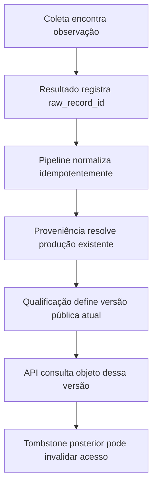

# Continuidade da ingestão e coerência da projeção pública

## Contexto

Esta especificação complementa `2026-09-08-pernambuco-ciencia-inovacao-design.md` e corrige três limites identificados após a revisão integral da fundação de ingestão. A implementação existente já coleta, preserva, normaliza, qualifica e publica metadados; o presente recorte garante que essas etapas continuem coerentes após interrupções, mudanças de identidade técnica e observações rejeitadas.

## Objetivo

Garantir que a ingestão seja recuperável entre etapas duráveis, que uma produção mantenha sua continuidade histórica quando o formato da identidade da fonte evoluir e que a API pública descreva exclusivamente o estado da versão qualificada atual.

## Escopo

O trabalho inclui:

1. retomada de observações colhidas e ainda não normalizadas;
2. compatibilidade entre identidades antigas baseadas no código da fonte e identidades novas baseadas no UUID imutável da fonte;
3. projeção do texto completo vinculada ao registro bruto da versão pública atual.

Não inclui nova extração semântica, interface gráfica, autenticação, novas fontes, alteração das regras de direitos ou integração real com PostgreSQL, Redis e MinIO neste ambiente.

## Decisões arquiteturais

### 1. Observações encontradas pelo harvest

O resultado da coleta deverá carregar, em ordem determinística e sem duplicação, os IDs de todas as observações encontradas durante a execução:

- registros brutos inseridos na execução atual;
- registros brutos idênticos já existentes e classificados como inalterados.

O pipeline processará essa lista explícita. Ele não dependerá de `RawRecord.harvest_run_id`, pois esse campo identifica apenas a execução que criou o registro, não todas as execuções que o reencontraram.

Como a normalização já é idempotente por `ProductionVersion.raw_record_id`, reprocessar uma observação encontrada não duplicará versões. Uma falha ocorrida depois da persistência bruta e antes da normalização será recuperada na próxima coleta.

### 2. Continuidade da identidade científica

Antes da deduplicação por identificadores textuais, a normalização procurará uma produção já relacionada a qualquer registro bruto com a mesma combinação:

- `RawRecord.source_id`;
- `RawRecord.source_identifier`.

Se encontrada, a nova observação será tratada como nova versão dessa produção. O `canonical_key` histórico não será reescrito. Assim:

- chaves antigas no formato baseado em código permanecem válidas;
- renomear `Source.code` não divide uma produção;
- fontes diferentes com identificadores textuais semelhantes permanecem separadas.

Quando não houver proveniência anterior, a criação continuará usando a identidade nova baseada no UUID da fonte.

### 3. Disponibilidade pública do texto completo

A API pública calculará `full_text_available` a partir de:

- `Production.current_version_number`;
- `ProductionVersion.raw_record_id` da versão atual;
- objeto durável associado exatamente a esse registro bruto.

Uma observação posterior que tenha sido rejeitada ou ainda não qualificada não poderá alterar a disponibilidade exibida para metadados antigos. O tombstone não substitui a versão bibliográfica válida: ele invalida separadamente o acesso e o texto completo até que uma observação viva posterior seja normalizada e qualificada como nova versão atual.

## Fluxo esperado

## Tratamento de erros

- Observações rejeitadas continuam auditadas e privadas.
- A retomada não deve transformar falha de uma observação em falha das demais.
- Identidades antigas sem ligação de proveniência não serão adivinhadas por texto; permanecem para tratamento por migração curatorial futura.
- A ausência ou falha do objeto ligado à versão atual resulta em `full_text_available: false`.

## Critérios de aceitação

1. Uma coleta persistida antes de uma interrupção é reencontrada numa nova execução, normalizada e qualificada sem criar outro `RawRecord`.
2. Executar o pipeline repetidamente permanece idempotente.
3. Uma produção criada com chave canônica antiga recebe uma nova versão, e não uma produção paralela, quando sua proveniência bruta possui a mesma fonte imutável e o mesmo identificador.
4. Alterar `Source.code` não altera essa continuidade.
5. Uma observação posterior rejeitada não esconde nem anuncia texto completo da versão pública vigente.
6. Um tombstone posterior à versão vigente apresenta acesso e texto completo indisponíveis sem substituir seus metadados bibliográficos.
7. Os testes existentes continuam aprovados; Ruff, mypy, smoke de runtime e Alembic offline permanecem limpos.

## Limitação de validação

O ambiente atual não dispõe de Docker nem de serviços ativos de PostgreSQL, Redis ou MinIO. A validação local continuará usando testes dialeto-neutros, testes de unidade, importação runtime e geração offline do DDL PostgreSQL. A execução integrada com serviços reais permanece um portão separado antes da implantação.
