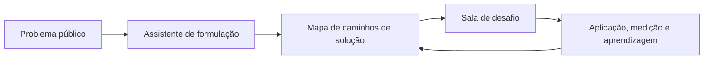
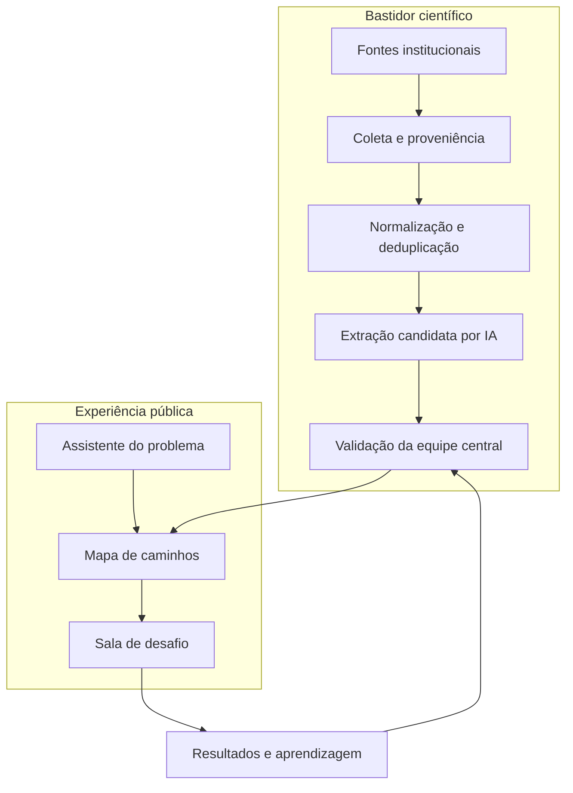
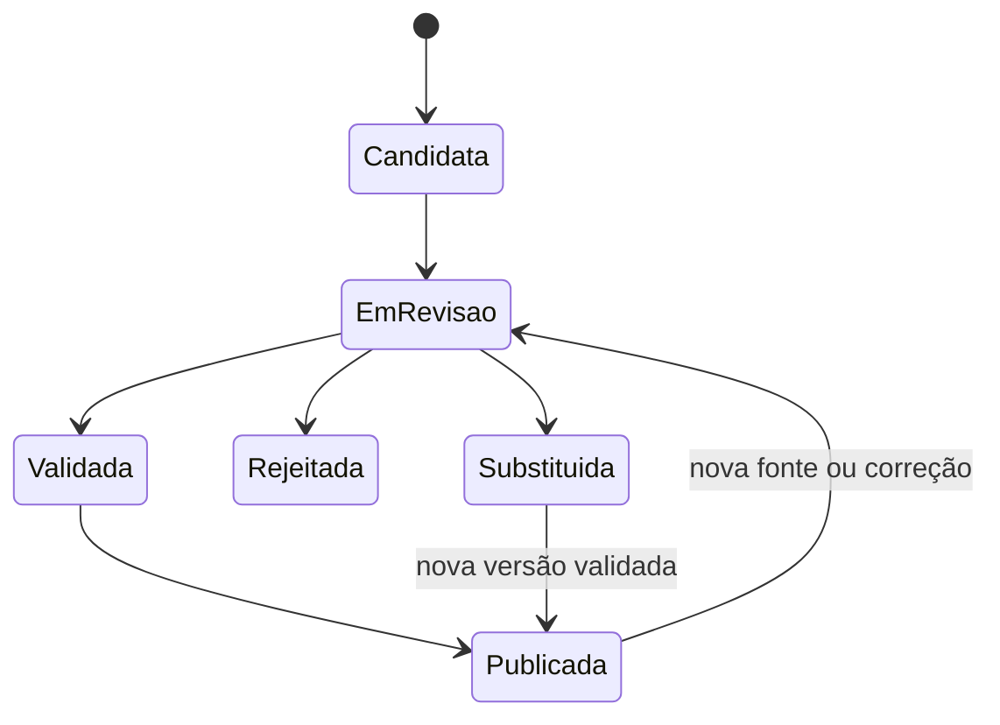

# ObservAInova: ecossistema de interação orientado a problemas públicos

**Versão:** 1.0  
**Data:** 21 de setembro de 2026  
**Status:** especificação consolidada para aprovação  
**Natureza:** artefato científico da tese e desenho funcional/técnico do novo MVP  
**Substitui:** a experiência pública centrada em catálogo e em páginas de produções da especificação de 8 de setembro de 2026  
**Preserva:** a infraestrutura de coleta, proveniência, normalização, deduplicação, armazenamento, qualificação e projeção pública implementada no PR #1

## 1. Decisão central

O ObservAInova não será apresentado como outro repositório de teses e dissertações. Os repositórios institucionais continuam sendo as fontes oficiais dos documentos; a plataforma cria uma camada de mediação entre um problema público e o conhecimento científico que pode ajudar a compreendê-lo, enfrentá-lo e avaliá-lo.

A jornada pública obrigatória será:

A tese ou dissertação é uma fonte de evidência. Ela não é o destino principal da navegação. O produto público principal é o **caminho de solução**, construído pela síntese de contribuições científicas validadas e contextualizado para o problema formulado. A **Sala de Desafio** transforma descoberta em interação, adaptação, experimentação e aprendizagem.

## 2. Problema científico e informacional

As teses e dissertações produzidas por instituições públicas sediadas em Pernambuco contêm diagnósticos, métodos, intervenções, tecnologias, resultados, limitações e conhecimentos aplicáveis a problemas públicos. Entretanto, esse conteúdo permanece organizado principalmente segundo a lógica documental: autoria, título, programa, instituição, data, assunto e tipo de produção.

O problema não é apenas encontrar um documento. É superar a distância entre:

- a maneira como um ator descreve uma necessidade pública;
- a maneira como a ciência formula seus objetos e resultados;
- as condições reais de adoção de uma contribuição científica;
- os diferentes atores necessários para transformar conhecimento em ação.

Essa distância produz uma barreira de informação para inovação: o conhecimento existe, mas não está representado, relacionado e mediado de forma adequada ao processo de resolução de problemas.

## 3. Pergunta de pesquisa e hipótese de trabalho

### 3.1 Pergunta de pesquisa

Como um ecossistema digital orientado a problemas públicos pode organizar, mediar e articular contribuições presentes em teses e dissertações de instituições públicas sediadas em Pernambuco para apoiar a construção colaborativa de caminhos de solução?

### 3.2 Hipótese de trabalho

A representação de teses e dissertações como contribuições científicas validadas — relacionadas a problemas, mecanismos, evidências, barreiras, contextos e condições de aplicação —, combinada com mediação conversacional, síntese em caminhos de solução e espaços colaborativos de experimentação, amplia a encontrabilidade, a compreensão e a capacidade de utilização da informação científica em processos de inovação orientados a problemas públicos.

## 4. Objetivo do artefato

Desenvolver e avaliar um ecossistema digital de interação que permita formular problemas públicos, descobrir e comparar caminhos de solução fundamentados em contribuições científicas validadas e organizar a colaboração entre atores para adaptação, experimentação e aprendizagem.

## 5. Escopo aprovado do corpus inicial

| Dimensão | Decisão operacional |
|---|---|
| Instituições | Universidades e institutos públicos de ensino e pesquisa sediados em Pernambuco |
| Fontes | Repositórios institucionais ou sistemas oficiais equivalentes |
| Tipos documentais | Teses e dissertações |
| Recorte analítico | 2016 a 2025 |
| Atualização corrente | Registros de 2026 entram como camada corrente e serão acompanhados separadamente |
| Áreas do conhecimento | Todas as áreas desde o início |
| Critério territorial inicial | Produção vinculada às instituições públicas sediadas em Pernambuco, independentemente do território estudado |
| Universo “sobre Pernambuco” externo | Adiado; produções de instituições externas cujo objeto seja Pernambuco não integram o primeiro corpus |
| Fontes-piloto | UFPE e IFPE; expansão posterior pelas mesmas regras de elegibilidade |
| Publicação | Metadados qualificados podem ser públicos; inteligência científica apenas após validação humana |
| Priorização da validação | Amostra estratificada e representativa |

O recorte temporal não elimina a preservação de registros anteriores eventualmente coletados. Ele define o corpus analisado na tese, as métricas comparáveis e a fila prioritária de enriquecimento e validação.

## 6. Público e papéis

O ObservAInova atende ao ecossistema amplo de inovação, com diferenças de responsabilidade.

| Papel | Responsabilidade principal |
|---|---|
| Visitante | Formular um problema, explorar mapas e consultar fundamentos públicos |
| Proponente | Salvar um problema, propor uma Sala de Desafio e informar contexto e restrições |
| Gestor público | Delimitar a demanda, avaliar aderência institucional e conduzir decisões |
| Pesquisador | Explicar contribuições, apontar limites e colaborar na adaptação científica |
| Especialista | Analisar contexto, viabilidade, riscos e condições de implementação |
| Organização ou empresa | Oferecer capacidade de implementação, tecnologia, serviço ou parceria pertinente |
| Equipe central | Validar inteligência científica, moderar publicação, governar taxonomias e auditar decisões |
| Administrador | Gerenciar segurança, permissões, fontes e configurações técnicas |

Participar da conversa ou de uma Sala de Desafio não confere autoridade para validar uma extração científica. Essa autoridade permanece com a equipe central.

## 7. Princípios de produto e de pesquisa

1. **O problema é a entrada.** A tela inicial não começa com lista de documentos, instituições ou filtros.
2. **A contribuição é a unidade científica.** A tese ou dissertação sustenta uma ou mais contribuições; não equivale automaticamente a uma solução.
3. **O caminho é uma síntese.** Um caminho de solução combina várias contribuições validadas e explicita relações, alternativas e lacunas.
4. **Interação precede decisão.** A plataforma ajuda a compreender, comparar e experimentar; não prescreve automaticamente uma política pública.
5. **Validação humana integral.** Nenhuma interpretação produzida por IA alimenta respostas públicas como fato antes da validação.
6. **Explicabilidade por fundamento.** Toda afirmação científica pública aponta para a fonte e para o trecho ou localização que a sustenta.
7. **Contexto condiciona aplicabilidade.** Evidência produzida em um contexto não é apresentada como transferência automática para outro.
8. **Ausência é informação.** Falta de evidência, conflito ou baixa aderência territorial são exibidos como lacunas, não preenchidos por suposição.
9. **Proveniência e versionamento.** Dados, decisões, sínteses, correções e resultados de aplicação mantêm autoria, data e histórico.
10. **Aprendizagem fecha o ciclo.** Resultados observados nas Salas de Desafio retornam como evidência de aplicação, sem serem confundidos com evidência científica original.

## 8. Arquitetura funcional

### 8.1 Camadas

| Camada | Função |
|---|---|
| Fontes científicas | Colher metadados e, quando permitido, texto completo ou trechos necessários à análise |
| Registro canônico | Preservar a produção, manifestações, autores, instituições, proveniência, direitos e versões |
| Inteligência candidata | Armazenar extrações da IA de forma privada, com confiança e fundamento textual |
| Curadoria científica | Validar, editar, rejeitar, substituir e versionar contribuições científicas |
| Camada semântica | Representar conceitos e vetores derivados exclusivamente das versões autorizadas para cada uso |
| Mediação do problema | Converter linguagem comum em problema estruturado e confirmado pelo usuário |
| Síntese de caminhos | Recuperar, agrupar, comparar e explicar contribuições validadas aplicáveis ao contexto |
| Colaboração | Registrar participantes, decisões, planos, experimentos, indicadores, resultados e aprendizados |
| Avaliação | Produzir métricas técnicas, informacionais, interacionais e de utilidade para a tese |

## 9. Modelo conceitual

### 9.1 Entidades nucleares

| Entidade | Definição | Regra crítica |
|---|---|---|
| Problema Público | Situação indesejada formulada e contextualizada por um usuário | Deve ser confirmado pelo usuário antes da recuperação final |
| Versão do Contexto | Estado temporal do problema, território, população, causas, restrições e objetivo | Mudanças relevantes geram nova versão e novo ranqueamento |
| Fonte Científica | Tese ou dissertação e seus metadados/proveniência | É evidência documental, não solução automática |
| Alegação Candidata | Extração feita por IA sobre uma fonte | É privada e não participa de respostas públicas |
| Contribuição Científica Validada | Unidade de conhecimento confirmada pela equipe central | Deve ter fundamento recuperável e escopo explícito |
| Caminho de Solução | Síntese versionada de contribuições relacionadas a um problema | Não pode existir como mera cópia de uma única produção sem justificativa explícita |
| Relação Caminho–Contribuição | Papel de cada contribuição em um caminho | Distingue diagnóstico, mecanismo, intervenção, avaliação, barreira e implementação |
| Competência | Relação entre atores e temas demonstrada por produções ou participação validada | Não equivale a endosso ou disponibilidade do ator |
| Sala de Desafio | Espaço moderado para transformar um problema e caminhos em ação colaborativa | Publicação exige análise da equipe central |
| Experimento | Teste delimitado de uma adaptação ou hipótese de implementação | Deve informar responsáveis, condições, indicadores e salvaguardas |
| Resultado de Aplicação | Medida observada em uma Sala | Não é promovida a evidência científica sem protocolo apropriado |
| Aprendizado | Síntese do que funcionou, não funcionou e em quais condições | Deve distinguir observação, interpretação e decisão |

### 9.2 Estrutura do Problema Público

Cada versão confirmada conterá:

- descrição original do usuário;
- formulação estruturada;
- território e unidade administrativa;
- população ou serviço afetado;
- consequências observadas;
- causas percebidas e grau de certeza;
- ações já tentadas e seus resultados;
- recursos disponíveis;
- restrições financeiras, regulatórias, institucionais, temporais, culturais e tecnológicas;
- resultado desejado;
- indicadores já utilizados;
- área de política pública e conceitos relacionados;
- consentimento de compartilhamento e visibilidade.

O assistente deve diferenciar fatos fornecidos, percepções do usuário e inferências provisórias.

### 9.3 Estrutura da Contribuição Científica Validada

Uma fonte pode originar zero, uma ou várias contribuições. Cada contribuição conterá:

- problema ou fenômeno investigado;
- tipo de contribuição: diagnóstico, explicação causal, método, intervenção, tecnologia, modelo, protocolo, recomendação, avaliação ou instrumento;
- descrição da contribuição;
- mecanismo esperado;
- população, serviço, organização ou território estudado;
- desenho/metodologia da pesquisa;
- resultados e evidências;
- barreiras e limitações;
- condições de aplicação;
- recursos e capacidades requeridos;
- nível de maturidade;
- riscos, contraindicações ou condições em que não se aplica;
- fonte, página, seção e trecho de fundamento;
- confiança da extração original;
- decisão, responsável e data da validação;
- versão e estado de publicação.

### 9.4 Estrutura do Caminho de Solução

Um caminho responderá, de forma comparável:

- que aspecto do problema enfrenta;
- qual transformação pretende produzir;
- por qual mecanismo;
- quais contribuições científicas o sustentam;
- qual força e tipo de evidência estão disponíveis;
- em quais contextos foi estudado;
- qual aderência possui ao território, população e restrições informados;
- quais recursos e atores requer;
- quais barreiras e riscos devem ser tratados;
- qual maturidade apresenta;
- o que permanece incerto;
- quais indicadores podem acompanhar uma aplicação;
- por que foi recuperado e como seu ranqueamento foi calculado.

### 9.5 Estrutura da Sala de Desafio

A sala conterá:

- versão do problema que motivou sua criação;
- responsável e organização proponente;
- escopo e visibilidade;
- participantes e papéis;
- caminhos selecionados, descartados ou combinados;
- justificativas e decisões;
- plano de adaptação;
- hipóteses e experimentos;
- responsáveis, cronograma e recursos;
- riscos, salvaguardas e dependências;
- indicadores de processo, resultado e contexto;
- registros de execução;
- resultados e aprendizados;
- estado de moderação e histórico.

## 10. Estados, visibilidade e governança

### 10.1 Estados da inteligência científica

### 10.2 Matriz de visibilidade

| Conteúdo | Público | Equipe central | Regra |
|---|---:|---:|---|
| Metadados qualificados da tese/dissertação | Sim | Sim | Respeitar direitos e proveniência |
| Texto completo | Quando autorizado | Quando autorizado | Não copiar conteúdo sem permissão |
| Alegação candidata da IA | Não | Sim | Nunca indexar no corpus público de respostas |
| Contribuição validada e publicada | Sim | Sim | Exibir fundamento e versão |
| Contribuição rejeitada | Não | Sim | Preservar justificativa e auditoria |
| Fonte ainda sem análise | Como “fonte em análise” | Sim | Não tratá-la como evidência do mapa |
| Problema privado do usuário | Não | Acesso mínimo autorizado | Configuração de visibilidade pelo proponente |
| Sala publicada | Conforme escopo | Sim | Exige moderação prévia |
| Resultado de experimento | Conforme escopo e consentimento | Sim | Identificar como evidência de aplicação |

### 10.3 Autoridade

- A IA sugere; não valida nem publica.
- Curadores da equipe central validam campo a campo.
- Especialistas podem emitir parecer, mas a decisão de publicação é da equipe central.
- Supervisores resolvem divergências e autorizam versões públicas.
- Toda mudança registra autor, instante, origem, justificativa e valores anterior/posterior.
- Correções humanas prevalecem sobre sugestões automáticas e alimentam a avaliação do modelo.

## 11. Jornada pública

### 11.1 Página inicial

O primeiro elemento da interface será a pergunta:

> **Qual problema público você precisa enfrentar?**

Abaixo dela existirão somente apoios de formulação, exemplos genéricos e acesso secundário à metodologia. Listas de teses, destaques institucionais e contadores de acervo não ocuparão o centro da página.

### 11.2 Assistente de formulação

O diálogo seguirá blocos adaptativos, não um formulário rígido:

1. acolher a descrição livre;
2. identificar o que ainda impede a compreensão do problema;
3. perguntar território, população/serviço e consequência;
4. separar causas percebidas de evidências disponíveis;
5. identificar tentativas anteriores, recursos e restrições;
6. perguntar o resultado desejado;
7. apresentar uma síntese estruturada;
8. solicitar confirmação ou correção;
9. somente então gerar o mapa.

O usuário poderá responder “não sei”. Campos desconhecidos permanecem desconhecidos; o assistente não inventará contexto.

### 11.3 Mapa de caminhos de solução

O mapa não será uma lista de documentos. Ele exibirá:

- caminhos principais e alternativas;
- contribuição esperada de cada caminho para o problema;
- evidência e maturidade;
- aderência ao contexto informado;
- barreiras, requisitos e riscos;
- relações de complementaridade, dependência ou conflito;
- lacunas de conhecimento;
- atores e competências relacionados;
- explicação de por que cada caminho apareceu.

O usuário poderá comparar caminhos, combiná-los, ajustar restrições e recalcular o mapa. As teses e dissertações estarão acessíveis na camada de fundamentos de cada contribuição.

### 11.4 Sala de Desafio

Qualquer ator autenticado poderá propor uma sala a partir de um problema confirmado e de um mapa. A proposta ficará em moderação. A equipe central verificará:

- clareza e interesse público do escopo;
- exposição de dados pessoais ou sensíveis;
- riscos de dano, uso indevido ou conflito de interesse;
- existência de responsável e regras mínimas de participação;
- distinção entre exploração, teste e decisão institucional.

Após aprovação, os participantes poderão selecionar e adaptar caminhos, registrar decisões, criar experimentos, acompanhar indicadores e produzir aprendizados. A plataforma não substitui aprovações éticas, jurídicas, administrativas ou técnicas exigidas fora dela.

## 12. Cenário de referência do MVP

Este cenário usa conteúdo demonstrativo e não afirma que existam contribuições reais já validadas sobre o tema.

1. Uma gestora escreve: “As pessoas estão esperando muito por consultas especializadas na rede municipal.”
2. O assistente pergunta município, especialidade, população afetada, tempo observado, causas percebidas, tentativas anteriores, restrições e resultado desejado.
3. A gestora confirma a formulação: “Reduzir o tempo de espera por consultas de cardiologia de adultos na rede municipal de Caruaru, preservando equidade de acesso, com orçamento e equipe atuais.”
4. O sistema recupera somente contribuições validadas e monta caminhos demonstrativos como “qualificar priorização clínica”, “reduzir faltas e ociosidade” e “integrar atendimento remoto quando adequado”.
5. Cada caminho mostra aderência contextual, evidências, maturidade, barreiras, recursos, incertezas e fundamentos documentais.
6. A gestora combina dois caminhos, informa uma restrição adicional e solicita novo ranqueamento.
7. Ela propõe uma Sala de Desafio, que é moderada pela equipe central.
8. Gestores, pesquisadores e especialistas definem uma adaptação, um teste delimitado e indicadores.
9. Os resultados são registrados como evidência de aplicação e usados para aprender, sem alterar silenciosamente a evidência científica original.

O cenário será transformado em teste ponta a ponta. Os rótulos demonstrativos jamais serão publicados como recomendações científicas sem fontes reais validadas.

## 13. Recuperação, síntese e ranqueamento

### 13.1 Recuperação híbrida

O sistema combinará:

- correspondência lexical;
- proximidade semântica;
- conceitos do vocabulário controlado;
- área de política pública;
- território e população;
- tipo de contribuição;
- condições, recursos e restrições;
- maturidade e força da evidência;
- barreiras e riscos;
- atualidade;
- status de validação.

### 13.2 Elegibilidade pública

Somente contribuições com estado `publicada`, fundamento aprovado e versão ativa entram no conjunto principal de recuperação. Metadados de fontes ainda não analisadas podem aparecer em um bloco separado, claramente identificado como **fontes potencialmente relacionadas em análise**, sem compor a síntese nem o escore científico.

### 13.3 Ranqueamento explicável

O escore interno será composto por dimensões normalizadas e versionadas:

- aderência temática ao problema;
- aderência ao território e contexto institucional;
- aderência à população ou serviço;
- compatibilidade com recursos e restrições;
- força e adequação da evidência;
- maturidade;
- risco e carga de barreiras;
- atualidade pertinente ao domínio;
- diversidade e complementaridade das fontes.

O usuário verá uma explicação em linguagem clara, não um número opaco isolado. Pesos e versões do modelo serão auditáveis. A relevância semântica não poderá compensar ausência de validação.

### 13.4 Síntese responsável

A resposta pública:

- utiliza apenas contribuições publicadas;
- cita os fundamentos usados;
- separa achado científico, inferência do sistema e dado fornecido pelo usuário;
- explicita divergências entre fontes;
- informa quando a evidência é indireta ou o contexto é diferente;
- evita linguagem prescritiva definitiva;
- mostra lacunas quando não há base suficiente.

## 14. Arquitetura técnica

### 14.1 Base canônica

PostgreSQL será a fonte oficial, relacional, versionada e auditável. A extensão `pgvector` armazenará representações semânticas derivadas. Índices de busca serão reconstruíveis a partir do banco oficial. Não haverá banco de grafo separado no primeiro MVP; relações de rede serão representadas em tabelas associativas e expostas como projeções.

### 14.2 Contextos de indexação separados

Serão mantidos conjuntos separados:

1. **metadados públicos**, para localização transparente das fontes;
2. **inteligência candidata privada**, para trabalho da equipe central;
3. **inteligência validada pública**, para assistente e mapas;
4. **conteúdo de salas**, conforme visibilidade e consentimento.

Nenhuma consulta pública terá permissão para recuperar vetores ou textos da camada candidata privada.

### 14.3 Módulos propostos

| Módulo | Responsabilidade |
|---|---|
| `ingestion` | Preservar conectores, coleta, proveniência e idempotência existentes |
| `productions` | Manter fontes e metadados como infraestrutura e transparência, não como jornada principal |
| `claims` | Criar, fundamentar, revisar e versionar alegações candidatas e contribuições validadas |
| `problems` | Registrar problemas e versões de contexto confirmadas |
| `matching` | Recuperar e ranquear contribuições elegíveis |
| `pathways` | Criar mapas, sínteses, relações e explicações versionadas |
| `rooms` | Moderar e operar Salas de Desafio |
| `learning` | Registrar experimentos, indicadores, resultados e aprendizados |
| `governance` | Permissões, taxonomias, auditoria e publicação |
| `evaluation` | Capturar métricas e conjuntos de julgamento da tese |

### 14.4 Contratos de serviço do primeiro MVP

Os nomes abaixo orientam o planejamento; detalhes de payload serão definidos no plano de implementação.

| Operação | Resultado esperado |
|---|---|
| Criar problema | Identificador e primeira versão privada |
| Registrar turno do assistente | Pergunta/resposta com proveniência e classificação |
| Confirmar problema | Versão imutável apta à recuperação |
| Gerar mapa | Conjunto versionado de caminhos e explicações |
| Recalcular mapa | Nova versão após mudança de contexto ou restrição |
| Consultar fundamento | Contribuições, fontes, trechos e decisões de validação públicas |
| Propor sala | Estado pendente de moderação |
| Moderar sala | Decisão registrada e publicação conforme escopo |
| Registrar decisão | Escolha, justificativa, participantes e versão do mapa |
| Criar experimento | Plano, responsáveis, riscos e indicadores |
| Registrar resultado | Medidas observadas e contexto |
| Publicar aprendizado | Síntese moderada, versionada e rastreável |

## 15. Segurança, privacidade e comportamento em exceções

| Situação | Comportamento obrigatório |
|---|---|
| Nenhuma contribuição validada | Informar lacuna; oferecer reformulação e fontes em análise separadas |
| Apenas alegações candidatas | Não gerar caminho público; mostrar somente metadados elegíveis como “em análise” |
| Problema amplo ou ambíguo | Continuar mediação antes de ranquear |
| Evidências contraditórias | Exibir divergência, contexto e limites; não colapsar em consenso artificial |
| Baixa aderência territorial | Informar que a transferência exige validação contextual |
| Falha da IA | Preservar o problema e permitir continuidade/revisão manual sem criar conteúdo fictício |
| Correção humana | Criar nova versão e retirar imediatamente a versão revogada do índice público |
| Caminho não testado | Identificar como hipótese ou baixa maturidade, nunca como solução comprovada |
| Dado pessoal/sensível em problema | Alertar, reduzir exposição e aplicar controle de acesso |
| Sala com risco relevante | Bloquear publicação até análise e salvaguardas apropriadas |
| Fonte removida | Preservar proveniência e marcar indisponibilidade; revisar contribuições afetadas |
| Mudança de taxonomia/modelo | Versionar, identificar impactos e reprocessar sem sobrescrever decisões anteriores |

## 16. Migração da lógica anterior

### 16.1 O que será preservado

- conectores OAI-PMH e mecanismos de coleta;
- preservação de payload e proveniência;
- normalização, identificadores e deduplicação;
- registro canônico de produções, atores, instituições e territórios;
- controle de direitos de armazenamento;
- filas, tentativas, estados temporais e mecanismos de concorrência;
- banco PostgreSQL, migrações, testes e infraestrutura de observabilidade;
- regra de metadados públicos e inteligência condicionada à validação.

### 16.2 O que muda

| Antes | Agora |
|---|---|
| Catálogo de produções como experiência dominante | Catálogo torna-se camada secundária de transparência |
| Busca retorna documentos/soluções isoladas | Assistente formula o problema e retorna caminhos sintetizados |
| Produção tratada como unidade principal de resposta | Contribuição validada é a unidade científica |
| Solução associada diretamente a uma produção | Caminho agrega contribuições com papéis e relações explícitos |
| Usuário encerra a jornada ao abrir o documento | Usuário compara, adapta, colabora, testa e aprende |
| Feedback de utilidade isolado | Sala registra decisões, experimentos, indicadores e resultados |
| Correspondência semântica domina relevância | Ranqueamento contextual, científico e explicável |

### 16.3 Compatibilidade

Rotas públicas de produções poderão continuar disponíveis para transparência, citações e fundamentos. Elas não serão usadas como página inicial nem como principal métrica de sucesso. Implementações posteriores à fundação que reforcem a jornada de catálogo devem ser reavaliadas antes de reaproveitamento; nenhuma base coletada precisa ser descartada.

## 17. Requisitos funcionais prioritários

| ID | Requisito |
|---|---|
| RF-01 | Receber uma descrição livre de problema público |
| RF-02 | Conduzir diálogo adaptativo para completar contexto sem inventar dados |
| RF-03 | Apresentar e registrar uma formulação confirmada pelo usuário |
| RF-04 | Criar versões do problema quando contexto ou restrições mudarem |
| RF-05 | Extrair alegações candidatas com fundamento textual e confiança |
| RF-06 | Permitir validação humana campo a campo pela equipe central |
| RF-07 | Impedir uso público de alegações não publicadas |
| RF-08 | Representar contribuições científicas separadamente das fontes documentais |
| RF-09 | Recuperar contribuições por similaridade lexical, semântica e contextual |
| RF-10 | Sintetizar contribuições em caminhos de solução versionados |
| RF-11 | Explicar relevância, evidência, maturidade, contexto, barreiras e lacunas |
| RF-12 | Permitir comparar, combinar e recalcular caminhos |
| RF-13 | Exibir fontes, trechos e decisões de validação de cada afirmação |
| RF-14 | Permitir salvar e compartilhar problema/mapa conforme controle de acesso |
| RF-15 | Permitir propor uma Sala de Desafio |
| RF-16 | Submeter a sala à moderação antes de publicação |
| RF-17 | Gerenciar participantes e papéis da sala |
| RF-18 | Registrar decisões, adaptações, experimentos e indicadores |
| RF-19 | Registrar resultados e aprendizados sem confundi-los com evidência científica |
| RF-20 | Capturar métricas necessárias à avaliação da tese |

## 18. Requisitos não funcionais

| ID | Requisito |
|---|---|
| RNF-01 | Rastrear toda afirmação pública até fonte, trecho, versão e validação |
| RNF-02 | Aplicar separação técnica entre inteligência candidata e pública |
| RNF-03 | Proteger problemas, salas e dados sensíveis por menor privilégio |
| RNF-04 | Oferecer explicações compreensíveis dos caminhos e do ranqueamento |
| RNF-05 | Manter acessibilidade e responsividade em toda a jornada |
| RNF-06 | Permitir reconstrução de índices sem perda da base canônica |
| RNF-07 | Versionar problemas, contribuições, mapas, decisões e aprendizados |
| RNF-08 | Preservar desempenho aceitável com expansão progressiva do corpus |
| RNF-09 | Registrar telemetria científica sem coletar dados pessoais desnecessários |
| RNF-10 | Manter interoperabilidade e identidade das fontes institucionais |

## 19. Avaliação científica do novo artefato

A avaliação não medirá apenas se o sistema recupera documentos. Ela verificará se a mediação transforma informação científica em caminhos compreensíveis e acionáveis sem apagar incertezas.

### 19.1 Extração e validação

- precisão, revocação e F1 por tipo de campo;
- concordância entre avaliadores;
- proporção de alegações com fundamento adequado;
- tempo e esforço de validação;
- tipos e frequência de correção humana;
- desempenho por área do conhecimento.

### 19.2 Recuperação e ranqueamento

- Precisão@k e nDCG@k;
- cobertura e diversidade de contribuições;
- aderência julgada ao território, população, restrições e objetivo;
- comparação entre busca lexical, semântica e contextual;
- qualidade percebida das explicações de relevância.

### 19.3 Mediação do problema

- completude do problema antes/depois do diálogo;
- correspondência entre intenção do usuário e formulação confirmada;
- número e utilidade das perguntas;
- capacidade de distinguir fato, percepção e desconhecimento;
- carga cognitiva, tempo e taxa de abandono.

### 19.4 Compreensão e utilidade

- capacidade de identificar alternativas, evidências, barreiras e lacunas;
- qualidade da comparação entre caminhos;
- confiança calibrada, sem excesso de certeza;
- utilidade percebida para avançar o enfrentamento do problema;
- sucesso em tarefas e escala SUS;
- intenção de uso e recomendação.

### 19.5 Interação e aplicação

- diversidade de atores participantes;
- decisões fundamentadas em contribuições do mapa;
- caminhos adaptados ou combinados;
- experimentos iniciados e concluídos;
- indicadores acompanhados;
- aprendizados registrados e reutilizados;
- casos em que a plataforma levou à revisão do próprio problema.

### 19.6 Comparação principal da tese

Em tarefas equivalentes e sobre o mesmo corpus, comparar:

1. acesso convencional por catálogo e palavras-chave;
2. acesso mediado pelo ObservAInova, com problema estruturado e mapa de caminhos.

O desfecho principal será a capacidade do participante de compreender caminhos cientificamente fundamentados e usá-los para definir um próximo passo justificável. Encontrar mais documentos, isoladamente, não será considerado sucesso suficiente.

## 20. Critérios de aceitação do MVP

O novo MVP será aceito quando:

- a página inicial começar por um problema público, sem catálogo dominante;
- o usuário conseguir formular, revisar e confirmar o problema;
- toda síntese pública utilizar exclusivamente contribuições validadas e publicadas;
- toda afirmação científica pública tiver fonte e fundamento recuperável;
- fontes ainda não analisadas forem separadas e identificadas como tal;
- o sistema gerar mapa comparável com caminhos, evidências, maturidade, barreiras, contexto e lacunas;
- o usuário puder alterar uma restrição e obter nova versão explicada do mapa;
- uma Sala de Desafio puder ser proposta, moderada e operada com papéis e histórico;
- decisões, experimentos, indicadores e aprendizados forem versionados;
- ausência de evidência produzir uma resposta de lacuna, não uma solução inventada;
- testes comprovarem que conteúdo candidato privado não alcança endpoints públicos;
- o cenário de referência funcionar de ponta a ponta com dados demonstrativos claramente rotulados;
- a instrumentação permitir executar o protocolo comparativo da tese.

## 21. Fases de implementação após aprovação

### Fase 0 — Reorientação e proteção

- registrar esta especificação como fonte de verdade do produto;
- preservar a fundação do PR #1;
- marcar planos de “descoberta pública” centrados em catálogo como substituídos;
- criar testes arquiteturais de separação entre metadados, candidatos e inteligência pública.

### Fase 1 — Problema como objeto central

- modelos de Problema Público e Versão do Contexto;
- serviço do diálogo e confirmação;
- página inicial e experiência conversacional;
- cenário demonstrativo do problema até a confirmação.

### Fase 2 — Contribuição científica e governança

- alegações candidatas, fundamentos e estados;
- console da equipe central;
- publicação e revogação versionadas;
- conjuntos de validação da amostra estratificada.

### Fase 3 — Mapa de caminhos

- recuperação híbrida e filtros de elegibilidade;
- agregação de contribuições;
- ranqueamento contextual e explicações;
- comparação, combinação e recálculo.

### Fase 4 — Sala de Desafio

- proposta e moderação;
- participantes, papéis e decisões;
- planos, experimentos, indicadores e aprendizados;
- regras de visibilidade e segurança.

### Fase 5 — Avaliação da tese

- corpus e tarefas de comparação;
- instrumentos de avaliação;
- telemetria e exportação analítica;
- estudo com atores do ecossistema de inovação.

Cada fase terá plano próprio, testes antes da implementação e critérios de conclusão verificáveis.

## 22. Fora do primeiro MVP

- ingestão de produções de instituições externas apenas por estudarem Pernambuco;
- ampliação imediata para artigos, patentes e todos os produtos tecnológicos;
- validação pública aberta de contribuições;
- publicação automática de conteúdo gerado por IA;
- decisão automática sobre política, contratação ou investimento;
- marketplace ou contratação dentro da plataforma;
- execução administrativa de políticas públicas;
- banco de grafo separado como fonte oficial;
- comprovação causal automática a partir de correlação semântica;
- promoção automática de resultados de salas a evidência científica.

## 23. Decisões que esta especificação fecha

- O produto é um ecossistema de interação, não um repositório alternativo.
- O problema público é a entidade inicial e a tese/dissertação é fonte.
- A contribuição científica validada é a unidade mínima de inteligência pública.
- O mapa de caminhos, não a lista de documentos, é o principal resultado científico da busca.
- A Sala de Desafio dá continuidade à jornada até adaptação, teste e aprendizagem.
- A coleta e a qualificação já implementadas continuam válidas como bastidor.
- IA e validação humana têm papéis separados e tecnicamente protegidos.
- O primeiro corpus abrange teses e dissertações de instituições públicas sediadas em Pernambuco, com análise de 2016–2025 e camada corrente de 2026.
- UFPE e IFPE são as fontes-piloto; todas as áreas permanecem incluídas.
- PostgreSQL com camada semântica é a arquitetura canônica inicial.

## 24. Condição para iniciar a implementação

A implementação do novo cenário começa somente após a aprovação explícita desta especificação. A etapa seguinte será produzir um plano técnico rastreável, com arquivos, migrações, testes, ordem de dependência e critérios de verificação para cada fase. Nenhuma interface centrada em catálogo será tratada como destino principal do produto.
